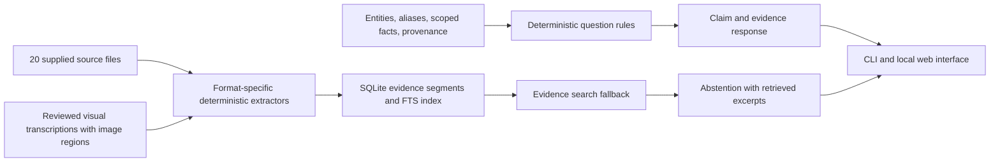

# Architecture design report

## Objective and design choices

The application turns the supplied heterogeneous Aegis package into indexed, source-located evidence and a small graph-shaped set of typed claims. A question reaches a deterministic answer rule; the rule names the claims, and each claim supplies its own evidence. A separate SQLite full-text index finds passages for questions without a matching rule. That fallback shows the passages as search context and abstains, because an excerpt by itself is not a validated answer.

The assessment does not require a model, a graph database, or a particular web framework. This implementation uses Python parsers, JSON as the editable knowledge representation, SQLite FTS5 for small-corpus retrieval, and the Python standard-library HTTP server for the browser interface. It has no model at runtime. For this fictional package, deterministic document parsing plus human-reviewed visual transcription produces reproducible evidence and avoids presenting OCR guesses or generated summaries as verified facts. The explicit rule pipeline is easy to inspect and discuss in a live review.

## Intermediate representation

The canonical identity and relationship registry is `aegis/knowledge/entities.json`. An entity has a stable `id`, a type, preferred name, declared aliases, and the sources that justify identity decisions. The `superseded_by` / `supersedes` relationship between PS-04 and PS-04A carries a firmware condition. It records two distinct hardware identities rather than merging the names. A location is an entity too, allowing a component register's location to be checked for a resolvable reference. Runtime alias resolution permits punctuation and spacing variants in instrument tags; collisions across different canonical IDs fail validation.

`aegis/knowledge/facts.json` is the fact store. Each record carries:

- `id`, `subject`, `predicate`, and a scalar, list, or `null` value.
- An optional unit and explicit scope, such as firmware revision, active sensor, configuration, or source record.
- A confidence class and assertion method. Confidence is categorical evidence quality, not a calibrated probability.
- One or more provenance objects with source path, page/section/cell/slide/region locator, and a supporting excerpt.

Different operating regimes remain separate claims. The normal operating pressure is represented as 180 bar for pre-3.2 firmware and 200 bar for revision 3.2 onward. A17 remains a 150 bar low-pressure alarm and is not merged into the 200 bar setpoint. A missing value is represented as `null` with a scoped `not_found_in_package` or `premise_not_supported` assertion and relevant evidence. Absence claims apply only to the reviewed files in this package.

The source corpus stays separately indexed. Each segment records a stable ID, media type, relative path, locator, extracted text, extraction method, source SHA-256, and optional metadata such as a normalized image-region bounding box. This permits new searches without rewriting the identity and claim registry. Extracted material is never copied over a fact's provenance.

## Ingestion pipeline

`aegis/extract.py` dispatches by extension and uses deterministic parsers:

| Format | Reader | Evidence unit |
| --- | --- | --- |
| Digital and scanned PDF | `pypdf` page text | PDF page; reviewed transcript for scanned page |
| HTML | `html.parser` | Heading, paragraph, list item, table row, plus complete visible text |
| XLSX/XLSM | `openpyxl` | Populated row with sheet and cell range |
| DOCX | `python-docx` | Paragraph, table row, header, or footer |
| PPTX | `python-pptx` | Slide shape, table, or speaker note |
| JSON | Python `json` | Typed leaf value and full JSON key path |
| PNG | Pillow metadata and reviewed transcription | Source image and named normalized image region |

The hydraulic and electrical diagrams are interpreted through reviewed sidecar transcriptions because plain text extraction loses line endpoints and line color. The image transcriptions name what is visible and preserve the relevant region. In the hydraulic schematic, a visually drawn grey line between controller and HPU conflicts with the legend. That ambiguity stays in the evidence model and the answer itself. The A17 screen and HMI home screen are marked as image snapshots with no trusted acquisition time.

The calibration scan contains text not present in any PDF text layer. Its one page was rendered and transcribed with its table rows and notes verified against the image. The extraction report labels it `human_transcription`; it is not attributed to OCR. A new image-only source does not receive invented text; an operator must review and add a transcription. Every ingest hashes source files, rebuilds the cache only after a file change, and writes `extraction_report.json` with per-file segment counts and methods. The assessment prompts are kept separate and are not indexed as answer evidence.

## Entity reconciliation, scope, and conflicts

Identity decisions use declared aliases and corroborating sources, not identifier substring guesses. For example, `P.S.04-A` resolves to PS-04A using the diagnostics screenshot's physical-label note and the component register. PS-40 remains distinct because the register locates it in the coolant loop on Skid B and explicitly separates it from the HPU discharge sensor.

Document authority is recorded claim by claim. The current operator manual, released change notices, alarm reference, configuration export, component register, drawings, training excerpt, undated field notes, and fluid-only safety sheet have different scopes. The field note's roughly 175 bar observation remains low confidence: its author says the gauge was uncalibrated, the software revision was unknown, and the observation was not cross-checked against diagnostics. It does not overwrite either revision-specific manual value.

Engineering Change Notice ECN-1042 establishes PS-04A and the 200 bar setpoint from revision 3.2. ECN-1058 changes the sensor reference used in the A17 description and leaves the alarm threshold unchanged. Revision history records 3.2 as effective 2025-09-30 and separately records the 3.2.1 documentation correction. A planned revision date does not establish that a release took place. No single 'latest value' wins when source scopes differ.

The training excerpt is an additional source with narrower scope. It describes an Auxiliary Reservoir on most Line 4/5 configurations. Its note identifies that detail as absent from the standard operator manual, so the system reports it as training-source-only scope instead of claiming that every unit has one.

## Query and user interface

`aegis/knowledge/answer_rules.json` declares deterministic intent terms and the exact fact IDs used by each response. All term groups in a rule must be present. The most specific unique rule wins. A tie or a question with insufficient specificity falls through to full-text retrieval and an abstention. The rules state their answer text and cite claims independently, making answer behavior reviewable without inspecting application code.

Every matched answer includes status, route, answer text, typed claims, resolved identifiers, supporting excerpts, exact source locators, extraction methods, claim confidence, unresolved points, and package-scope limits. A `null` value cannot produce an answered status. The browser displays those fields and the CLI can print the same structure with `--json`. The HTTP API is `POST /api/ask`; `GET /health` provides local index status. Requests have a size limit. The server binds only to loopback and sends restrictive security headers. No user text is interpolated as HTML.

## Evaluation approach

The original assessment supplies 23 questions but no official answers or metric definitions. `aegis/benchmarks/questions.json` provides a curated expected route, answerability label, and required fact IDs for each prompt. Eighteen questions have direct support in the supplied corpus. Five request facts the sources do not establish, or assume a voltage sensor that the drawing does not identify. The expected behavior for those five is abstention with source-bounded context.

The evaluator counts a case as exactly correct only if its route and answerability state match the curated key, every expected fact appears, each expected citation's source and locator match, the cited file exists, and the supporting excerpt is emitted. It separately reports accuracy for the answerable and abstention groups, expected-fact recall, citation completeness, and full-corpus extraction counts. This evaluates the known challenge questions and the authored answer key; it is not a general QA test, an unseen-data score, or a benchmark of probabilistic confidence.

## Loss and confidence analysis

The most important potential extraction losses are visual topology, small or rotated text, merged headers, page-to-section boundaries, and implicit firmware applicability. Visual evidence is therefore transcribed with named regions and reviewed descriptions. Spreadsheet cells retain row and column references. Digital PDF pages stay intact so table context is available even when a page contains merged headers. Curated facts quote the smaller claim-supporting span.

Information that has no resolvable value stays missing. The supplied package does not give a maximum PS-04A operating temperature, an ECN-1058 approver, IV-21 MTBF, a voltage-sensor calibration interval, or affirmative three-phase 400 V compatibility. The sensor-interval record explicitly directs readers to a maintenance schedule that is not supplied. The system will not infer these values from the safety data sheet, a transformer's control voltage, or a noisy field observation.

Confidence labels distinguish direct controlled or source-backed evidence (`high`), limited or out-of-scope evidence (`medium`), and an unverified report (`low`). They do not promise a statistical likelihood. Provenance and scope provide the audit trail needed to judge each result.

## Operational limits

The actual provided operator and maintenance manuals contain two and one pages, despite the task brief listing 12 and 18. Indexing reports reflect the actual files. The one-page maintenance manual omits referenced procedures and maintenance schedules; the system cannot reconstruct them. The rules are narrow and deterministic. New question phrasing may fall back to search until an answer rule and its evidence are reviewed. The loopback UI has no external authentication and is intended for local access; shared-network use requires an authenticated deployment layer.
